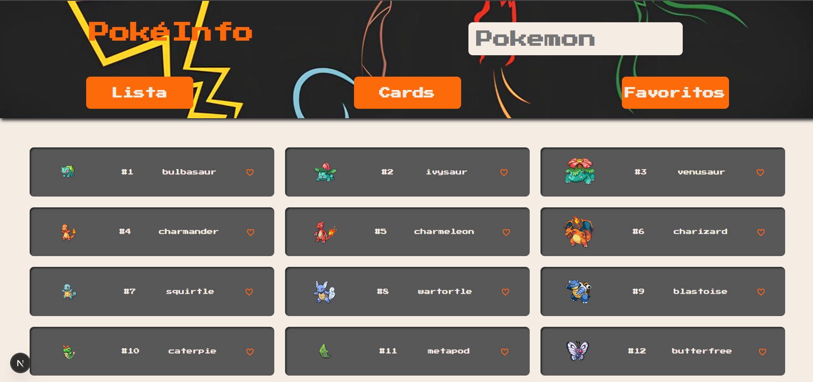

[LICENSE__BADGE]:
  https://img.shields.io/github/license/seu-usuario/pokedex?style=for-the-badge
[TYPESCRIPT__BADGE]:
  https://img.shields.io/badge/typescript-D4FAFF?style=for-the-badge&logo=typescript
[NEXT_BADGE]:
  https://img.shields.io/badge/Next.js-000?style=for-the-badge&logo=next.js
[REACT__BADGE]:
  https://img.shields.io/badge/React-005CFE?style=for-the-badge&logo=react
[PRS_BADGE]: https://img.shields.io/badge/PRs-welcome-green?style=for-the-badge

<h1 align="center" style="font-weight: bold;">Pokédex ⚡</h1>

![license][LICENSE__BADGE] ![next][NEXT_BADGE] ![react][REACT__BADGE]
![typescript][TYPESCRIPT__BADGE] ![prs][PRS_BADGE]

<details open="open">
<summary>📑 Índice</summary>
 
- [📌 About](#about)
- [🚀 Getting started](#started)
  - [Prerequisites](#prerequisites)
  - [Cloning](#cloning)
  - [Starting](#starting)
- [📍 Application Routes](#routes)
- [🤝 Collaborators](#colab)
- [📫 Contribute](#contribute)
  
</details>

<p align="center">
    
</p>

<h2 id="about">📌 Sobre</h2>

Aplicação **Front-end** de uma **Pokédex** construída com **Next.js, React e
TypeScript**.  
Permite listar Pokémons, visualizar detalhes de cada um e favoritar para salvar
sua coleção.

<h2 id="started">🚀 Iniciando</h2>

Siga os passos abaixo para rodar o projeto localmente.

<h3>Pré-requisitos</h3>

- [NodeJS](https://nodejs.org/en/) >= 18.0.0
- [Git](https://git-scm.com/)

<h3>Clonando</h3>

```bash
git clone https://github.com/Ceduardoz/wsFrontend-Fabrica25.2.git
```

<h3>Começando</h3>

```bash
cd pokeinfo
npm install
npm run dev
```

A aplicação estará disponível em [http://localhost:3000](http://localhost:3000).

<h2 id="routes">📍 Rotas da Aplicação</h2>

| route                    | description                                          |
| ------------------------ | ---------------------------------------------------- |
| <kbd>/</kbd>             | Página inicial que lista todos os Pokémons           |
| <kbd>/detalhes/:id</kbd> | Mostra os detalhes de um Pokémon específico          |
| <kbd>/favoritos</kbd>    | Página que lista os Pokémons marcados como favoritos |

<h2 id="colab">🤝 Colaboradores</h2>

Carlos Eduardo

<table>
  <tr>
    <td align="center">
      <a href="https://github.com/Ceduardoz">
        <br>
        <sub>
          <b>Carlos Eduardo</b>
        </sub>
      </a>
    </td>
  </tr>
</table>
